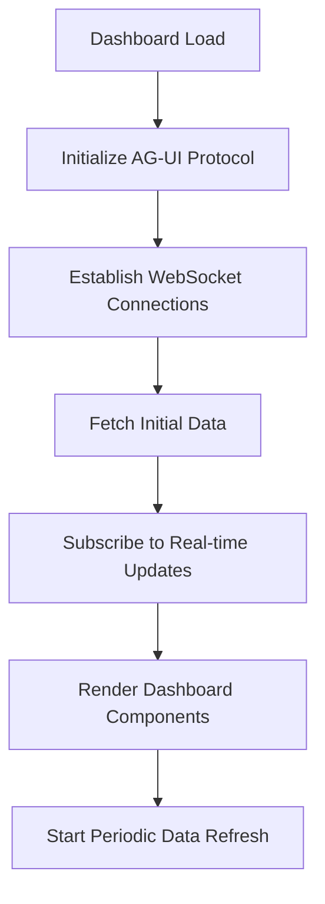
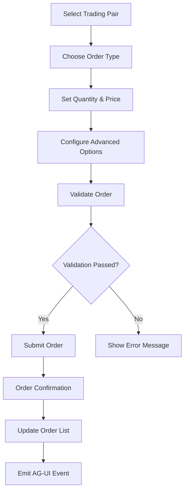
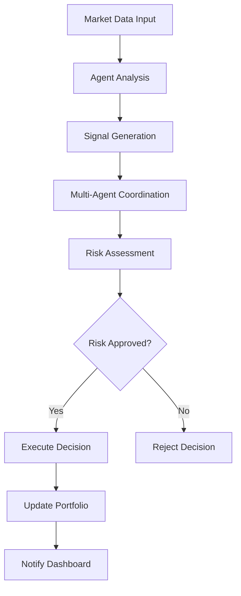
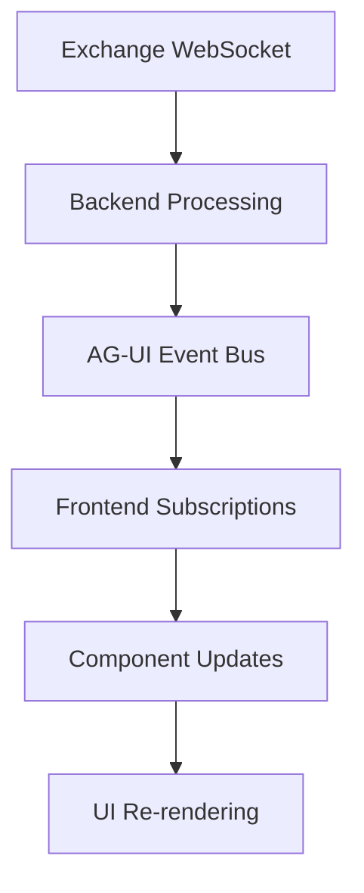
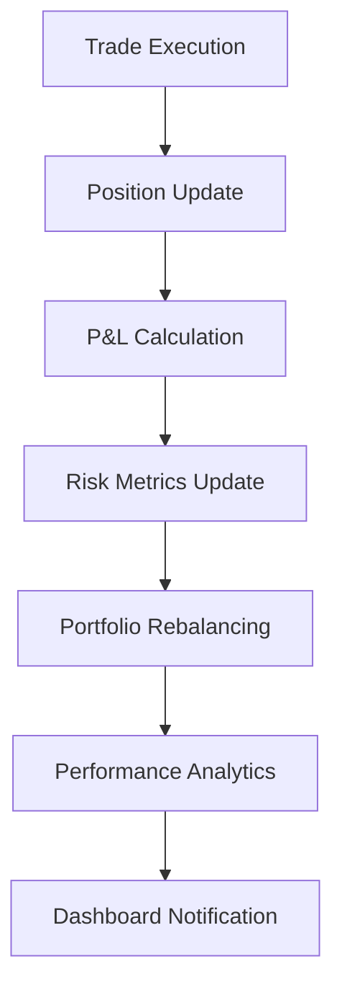
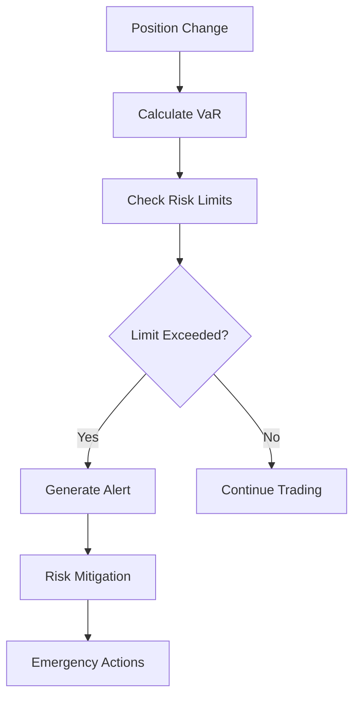
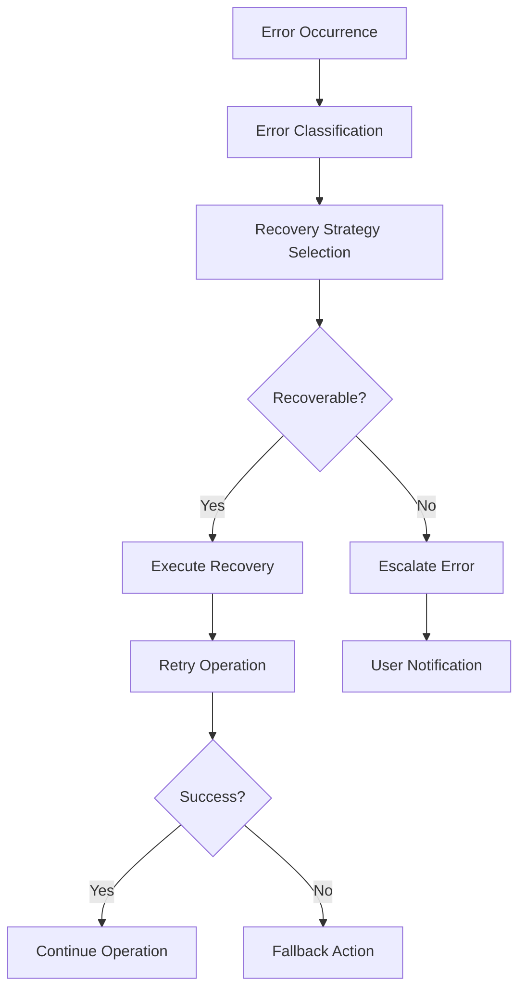

# Cival Trading Platform - Application Flow Documentation

## 🚀 User Journey & Application Flow

### 1. Application Entry Points

#### 1.1 Direct Dashboard Access (Solo Operator Mode)
```
User Access → Dashboard → Authentication Bypassed → Trading Interface
```

**Flow Details:**
1. User navigates to application URL
2. Next.js App Router loads the main layout
3. Authentication check is bypassed (solo operator mode)
4. User is immediately directed to the main dashboard
5. Real-time data connections are established

#### 1.2 Page Navigation Structure
```
/ (Root)
├── /dashboard (Main Trading Dashboard)
├── /trading (Advanced Trading Interface)
├── /portfolio (Portfolio Management)
├── /analytics (Performance Analytics)
├── /agents (AI Agent Management)
├── /risk (Risk Management)
└── /settings (System Configuration)
```

### 2. Main Dashboard Flow

#### 2.1 Dashboard Initialization


**Detailed Steps:**
1. **Component Mounting**
   - TradingDashboard component loads
   - State management initialization
   - Event subscriptions setup

2. **Data Fetching**
   ```typescript
   // Parallel data fetching
   Promise.all([
     fetchEngineStatus(),
     fetchPortfolioSummary(), 
     fetchAgentStatus(),
     fetchRiskMetrics()
   ])
   ```

3. **Real-time Setup**
   ```typescript
   // WebSocket subscriptions
   subscribe('trade.signal_generated', handleSignal)
   subscribe('portfolio.value_updated', handlePortfolioUpdate)
   subscribe('agent.decision_made', handleAgentDecision)
   ```

#### 2.2 Dashboard State Management
```
Initial State → Loading → Data Fetched → Real-time Updates → User Interactions
```

### 3. Trading Interface Flow

#### 3.1 Order Placement Flow


**Implementation Details:**
```typescript
const handlePlaceOrder = async () => {
  // 1. Validate order parameters
  const validationError = validateOrder()
  if (validationError) {
    setOrderError(validationError)
    return
  }
  
  // 2. Prepare order data
  const orderData = {
    symbol: selectedPair.symbol,
    side: orderSide,
    type: orderType,
    quantity: parseFloat(quantity),
    price: orderType !== 'market' ? parseFloat(price) : undefined
  }
  
  // 3. Submit to backend
  const response = await fetch('/api/trading/orders', {
    method: 'POST',
    body: JSON.stringify(orderData)
  })
  
  // 4. Handle response
  if (response.ok) {
    emit('trade.order_placed', orderData)
    refreshData()
  }
}
```

#### 3.2 Market Data Flow
```
Exchange APIs → Backend Aggregation → WebSocket Distribution → Frontend Updates → Chart Rendering
```

### 4. AI Agent Coordination Flow

#### 4.1 Agent Decision Making Process


**Agent Lifecycle:**
1. **Initialization**
   ```python
   # Agent startup
   agent = TradingAgent(config)
   agent.initialize()
   agent.start_monitoring()
   ```

2. **Signal Processing**
   ```python
   # Continuous monitoring
   while agent.is_active:
       market_data = await get_market_data()
       signal = agent.analyze(market_data)
       if signal.strength > threshold:
           await coordinate_with_other_agents(signal)
   ```

3. **Decision Execution**
   ```python
   # Coordinated execution
   coordinated_decision = await agent_coordinator.evaluate(signals)
   if coordinated_decision.approved:
       await trading_engine.execute(coordinated_decision)
   ```

#### 4.2 Agent Communication Protocol
```
Agent A → Decision → Coordinator → Validation → Other Agents → Consensus → Execution
```

### 5. Real-time Data Flow

#### 5.1 AG-UI Protocol v2 Event Flow


**Event Types & Handlers:**
```typescript
// Trading Events
'trade.signal_generated'    → Update signals display
'trade.order_placed'        → Add to order list
'trade.order_filled'        → Update order status
'trade.order_cancelled'     → Remove from active orders

// Portfolio Events  
'portfolio.value_updated'   → Update total value
'portfolio.position_changed' → Update positions list
'portfolio.risk_alert'      → Show risk warning

// Market Events
'market_data.price_update'  → Update price displays
'market_data.orderbook'     → Update order book
'market_data.trade'         → Add to trade feed

// Agent Events
'agent.decision_made'       → Update agent status
'agent.performance_update'  → Update metrics
'agent.error'              → Show agent errors
```

#### 5.2 Data Synchronization
```
Backend State → WebSocket Events → Frontend State → UI Updates → User Feedback
```

### 6. Portfolio Management Flow

#### 6.1 Portfolio Tracking Process


**Portfolio State Management:**
```typescript
interface PortfolioState {
  totalValue: number
  totalGain: number
  dailyPnl: number
  positions: Position[]
  trades: Trade[]
  performance: PerformanceMetrics
}

// Real-time updates
const updatePortfolio = (tradeData: TradeEvent) => {
  // 1. Update positions
  updatePosition(tradeData.symbol, tradeData.quantity)
  
  // 2. Calculate P&L
  const pnl = calculatePnL(tradeData)
  
  // 3. Update metrics
  updatePerformanceMetrics(pnl)
  
  // 4. Emit update event
  emit('portfolio.value_updated', portfolioState)
}
```

### 7. Risk Management Flow

#### 7.1 Risk Assessment Process


**Risk Monitoring:**
```typescript
const riskMonitor = {
  // Real-time risk calculation
  async calculateRisk(portfolio: Portfolio) {
    const var = calculateVaR(portfolio)
    const exposure = calculateExposure(portfolio)
    const correlation = calculateCorrelation(portfolio)
    
    return {
      portfolioRisk: var,
      maxDrawdown: exposure,
      correlation: correlation
    }
  },
  
  // Risk limit checking
  checkLimits(metrics: RiskMetrics) {
    if (metrics.portfolioRisk > config.maxRisk) {
      emit('portfolio.risk_alert', {
        type: 'var_breach',
        level: metrics.portfolioRisk,
        threshold: config.maxRisk
      })
    }
  }
}
```

### 8. Chart & Analytics Flow

#### 8.1 Chart Data Processing
```
Raw OHLCV Data → Technical Indicators → Chart Rendering → User Interactions → Strategy Overlays
```

**Chart Update Cycle:**
```typescript
// Chart data processing
const processChartData = async (symbol: string) => {
  // 1. Fetch OHLCV data
  const ohlcv = await fetchOHLCV(symbol, timeframe)
  
  // 2. Calculate indicators
  const indicators = calculateIndicators(ohlcv)
  
  // 3. Combine data
  const enrichedData = combineData(ohlcv, indicators)
  
  // 4. Update chart
  updateChart(enrichedData)
}

// Real-time price updates
subscribe('market_data.price_update', (priceData) => {
  updateLatestCandle(priceData)
  recalculateIndicators()
  renderChart()
})
```

### 9. Error Handling Flow

#### 9.1 Error Processing Chain


**Error Recovery Implementation:**
```typescript
// Error handling with recovery
const withErrorHandling = async (operation: Function) => {
  try {
    return await operation()
  } catch (error) {
    if (error instanceof TradingError) {
      const recovered = await errorRecoveryManager.handleError(error)
      if (recovered) {
        return await operation() // Retry
      }
    }
    throw error // Re-throw if not recoverable
  }
}
```

### 10. Performance Optimization Flow

#### 10.1 Data Loading Strategy
```
Initial Load → Critical Data → Progressive Enhancement → Background Updates → Caching
```

**Optimization Techniques:**
1. **Code Splitting**
   ```typescript
   // Dynamic imports for heavy components
   const TradingCharts = dynamic(() => import('./TradingCharts'), {
     loading: () => <ChartSkeleton />
   })
   ```

2. **Data Virtualization**
   ```typescript
   // Virtual scrolling for large datasets
   const VirtualOrderBook = ({ orders }) => (
     <VirtualList
       items={orders}
       renderItem={OrderRow}
       height={400}
     />
   )
   ```

3. **Caching Strategy**
   ```typescript
   // Multi-level caching
   const getCachedData = async (key: string) => {
     // 1. Memory cache
     if (memoryCache.has(key)) return memoryCache.get(key)
     
     // 2. Redis cache  
     const cached = await redis.get(key)
     if (cached) return JSON.parse(cached)
     
     // 3. Database query
     const data = await database.query(key)
     await redis.setex(key, 300, JSON.stringify(data))
     return data
   }
   ```

### 11. Security Flow

#### 11.1 Security Validation Chain
```
Request → Rate Limiting → Authentication → Authorization → Input Validation → Execution → Audit
```

**Security Implementation:**
```typescript
// Request security pipeline
const securityMiddleware = [
  rateLimitMiddleware,      // Prevent abuse
  authenticationMiddleware, // Verify identity  
  authorizationMiddleware,  // Check permissions
  validationMiddleware,     // Validate input
  auditMiddleware          // Log activities
]
```

### 12. Deployment Flow

#### 12.1 CI/CD Pipeline
```
Code Push → Build → Test → Deploy to Railway → Health Check → Live Traffic
```

**Deployment Steps:**
1. **Build Process**
   ```bash
   npm run build          # Frontend build
   python -m build        # Backend build
   docker build .         # Container build
   ```

2. **Health Validation**
   ```bash
   npm run test          # Unit tests
   npm run e2e           # Integration tests
   curl /health          # Health check
   ```

3. **Production Deployment**
   ```bash
   railway deploy        # Deploy to Railway
   railway logs          # Monitor deployment
   ```

---

**Document Version:** 1.0  
**Last Updated:** December 2025  
**Flow Complexity:** High (Multi-threaded, Real-time, Distributed)